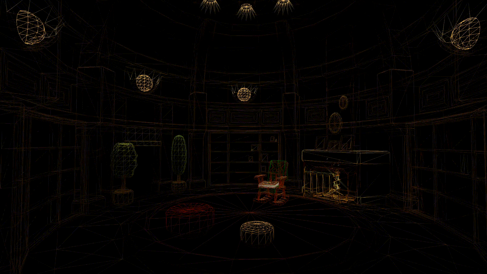

<div align="center">

# 📖 The Library

```
      __...--~~~~~-._   _.-~~~~~--...__
     //               `V'               \\ 
     //                  |                 \\ 
     //__...--~~~~~~-._  |  _.-~~~~~~--...__\\ 
    //__.....----~~~~._\ | /_.~~~~----.....__\\
    ====================\\|//====================
    `---`


```

</div>

---

<details>
<summary>📕 <b>Contents</b></summary>

<br>

```javascript
const person = {
      name: "Jonathan Theofilas",
      location: "Melbourne, Australia 🇦🇺",
      education: "RMIT — Bachelor of Computer Science (Class of 2025)",
      languages: "English, Greek"

};
```

Hey there! I'm Jonathan — a recent Computer Science graduate from RMIT. When I'm not exploring new repositories, you'll find me working on cloud architectures, building AR applications, or developing personal projects to continue honing my skills and exploring new technologies.

I've spent 5+ years writing Python, built full-stack systems on AWS, won a People's Choice Award at a Boeing hackathon, and somehow also managed 5+ years of high-pressure café operations (great for debugging skills, honestly).

</details>

---

<details>
<summary>📗 <b>The Linked Inn</b></summary>

<br>

<div align="center">

[](https://www.linkedin.com/in/jonathan-theofilas-9454732b7)


</div>

</details>

---

<details>
<summary>📘 <b>The Tech Stack Files</b></summary>

<br>

<div align="center">

#### Core Languages


#### Cloud (AWS)


#### Frameworks & Runtime


#### Databases


#### DevOps & Tools


</div>

</details>

---

<details>
<summary>📙 <b>The Archives</b></summary>

<br>

| # | Chapter | Description | Shelf |
|---|---------|-------------|-------|
| 📖 I | **[AWS Cloud Music Platform](https://github.com/JonathanTheofilas/AWS-Music-Subscription-System.git)** | Full-stack music subscription system with DynamoDB, S3, and advanced search | `AWS` `DynamoDB` `S3` |
| 📖 II | **GameSight AR Visualiser** | Augmented reality app for Meta Quest 3s, built for RMIT's RoboCup team | `Unity` `AR` `Meta Quest` |
| 📖 III | **[Property Rental Web App](https://github.com/JonathanTheofilas/AirBnB-Clone---Property-Booking-Platform.git)** | Node.js/MongoDB full-stack application handling 10,000+ listings | `Node.js` `MongoDB` `Express` |
| 📖 IV | **Data Intelligence Project** | Python-powered analytics achieving 92% prediction accuracy | `Python` `ML` `Analytics` |

</details>

---

<details>
<summary>📓 <b>The Builder's Journal</b></summary>

<br>

| Status | Chapter | Description |
|--------|---------|-------------|
| 🔨 Active | **[SQLite Clone](https://github.com/JonathanTheofilas/sqlite-clone.git)** | Building a complete database engine from scratch in C — B-tree storage, SQL parsing, transaction handling |
| 🔨 Active | **[BPE Tokeniser](https://github.com/JonathanTheofilas/BPE-Tokeniser.git)** | Educational Byte Pair Encoding implementation with 1000 merge iterations on a multilingual corpus |
| 🔨 Active | **[Langton's Bug Farm](https://github.com/JonathanTheofilas/Langtons-Bug-Farm.git)** | Advanced cellular automata simulator — Langton's Ant, Turmites, custom Turing machines with real-time visualisation |

</details>

---

<details>
<summary>📋 <b>Glossary</b></summary>

<br>

| Badge | Achievement | Details |
|-------|-------------|---------|
| 🎓 | **RMIT Graduate** | Bachelor of Computer Science (December 2025) |
| 🥇 | **People's Choice Award** | Boeing Technical Hackathon — November 2022 |

</details>

---

<div align="center">



<br>


</div>
